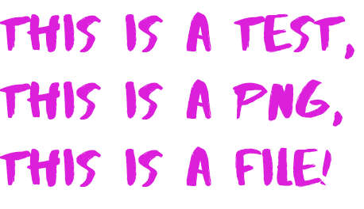

This file is created entirely by Pavel Bogdanov

To use this Markdown cheat sheet, view it in RAW form and in RENDERED form side by side.


##### Chapter 1
###### Normal text. And line spacing 

To write normal text in markdown: simply write normal text like in any other editor. Spaces separate sentences. Sentences can also be separated by starting a new sentence on a new line. Notice how this affects rendering.
This sentence was started on a new line. 

This sentence was started after skipping one line. Notice how this also affects rendering.


##### Chapter 2
###### Comments

Becasue Markdown is rendered into HTML, comments in markdown can be written like comments in HTML.
Comment is written below this line:

<!--This comment is written, but NOT rendered-->

Comment is written above this line.


##### Chapter 3
###### Lines

To create a line, type 3 or more hyphens. Skip at least one line between the last text content and the new hyphens.

---
-----


To create a line, type 3 or more asterisks. You do NOT have to skip any lines between text and asterisks.
***
********

To create a line, type 3 or more Underscores. You do NOT have to skip any lines between text and underscores.
___
__________

In some other flavors of Markdown, using 3 equal signs === also creates a new line. In github flavor Markdown 3 equal signs means nothing.


##### Chapter 4
###### Escape charachter

The escape charachter in Markdown is the backwards slash: \ 
The backwards slash allows us to render raw data instead of rendering interpreted data. An example of use is when somebody wants to draw 3 asterisks instead of drawing a line

Before:

***

After:

\***


##### Chapter 5
###### Headers with underlines

To write a large header with an underline, simply do not skip an extra space after text, and write 3 equal signs on the line below.

This is a giant header with an underline.
===

To write a slightly smaller header with an underline, use minus signs instead

This is a slightly smaller header with an underline.
---

Please note that not all renderers will show this properly. We are focused on GitHub flavored markdown, not on any other flavor.

A reminder that we can use the escape charachter from chapter 4 to write equal signs or minuses without having to render an underlined header
\===

Hera are some minuses on the next line also without rendering an underlined header.
\---


##### Chapter 6
###### Headers without underlines

In markdown headers without lines attatched to them come in 6 sizes:

# Size 1 header
## Size 2 header
### Size 3 header
#### Size 4 header
##### Size 5 header
###### Size 6 header
####### Seven or more hashtags do not render anything special.

Different renderers can and will display the same format with different sizes and styles


##### Chapter 7
###### Text Style

Text can be styled in bold, italic, stricetrough and any combination of the 3. 
Use asterisks, underscores or a combination of the 2 for styling. 1 asterisk or underscore is italic. 2 asterisks or underscores is bold. 3 is both

*Italic text*
**Bold text**
***Text that is BOLD and ITALIC***

_Italic text_
__Bold text__
___Text that is BOLD and ITALIC___

For striketrough text use ~
This is a technical manual:
These are instructions are old and obsolete: ~~blah blah~~
Here are some new instructions instead: blah blah blah

You can combine different combinations for fun. You can also use the scape charachter to display cool text

_\*Italic text\*_

*\_Italic text\_*

\*Not italic text\*

\_Not italic text\_

__This is a BOLD sentence__

\_\_This is a NORMAL sentence\_\_

__\_\_This is a BOLD sentence\_\___

_**This is a BOLD & ITALIC sentence**_

_**\_\*\*This is a BOLD & ITALIC sentence\*\*\_**_

Password is ~~aaa~~ bbb. <=Normal striketrough

Password is __~~aaa~~__ bbb. <= Bold striketrough

Password is ~~__aaa__~~ bbb. <= Bold striketrough

Password is ~~**aaa**~~ bbb. <= Bold striketrough

Password is **~~aaa~~** bbb. <= Bold striketrough

Password is *~~aaa~~* bbb. <= Italic striketrough

Password is ~~*aaa*~~ bbb. <= Italic striketrough

Password is _~~aaa~~_ bbb. <= Italic striketrough

Password is ~~_aaa_~~ bbb. <= Italic striketrough

Password is ***~~aaa~~*** bbb. <= Bold and italic striketrough
order does **NOT** matter!!!

Password is *~~**aaa**~~* bbb. <= Bold and italic striketrough

Password is *~~__aaa__~~* bbb. <= Bold and italic striketrough

Password is _~~__aaa__~~_ bbb. <= Bold and italic striketrough

###### CONVENTION STATES THAT STRIKETROUGH is on OUTERPART!!!!

***~~aaa~~***  <= WRONG!!!

~~_**aaa**_~~  <= right!!!

Headers are by nature bold. You can make them italic and striketrough too.

### This header is _italic_ and ~~striketrough~~. ~~_Maybe even both_~~.


##### Chapter 8
###### Quotes, inline code, codeblock by indentation, codeblock by backticks, codeblock by defenition.

###### Quotes

>This is a quote from some famous dude. Somebody famous said something like this using those words.
Starting a new line does NOT end the quote.

Skipping a line does.

###### Inline code

When using linux OS, open the terminal and type `cd /folder/anotherfolder/temp`. That was easy
Once in the temp directory, execute the following command: `rm -rf newfolder/*` Don't forget to be logged on as sudo

###### Codeblock by indentation

Code block can be blocked off by skipping 4 or more spaces

    def add_two(x , y):
        print("Now adding two numbers")
        z = z + y
        return z

      
Code block can be shown by using backticks

```
function newFunction(x + y){
console.log("Working hard")
return x + y;}

``` 

Codeblock can be properly colored by declaring a language inside the codeblock


```javascript
function newFunction(x + y){
console.log("Working hard")
return x + y;}

``` 

```python
def add_two(x , y):
    print("Now adding two numbers")
    z = z + y
    return z

``` 


##### Chapter 9
###### Tables

To create tables  use vertical pipes and dashes

|Food | Fats  | Carbs | Proteins | 
|-|-|-------------------------------------|-|
Donuts | 5 oz | 10 oz | 0 oz|
Burgers | 1lb | 4 oz | 4 oz|
Cabbage | 0 oz | 5 oz | 6 oz|

note that spacing does **NOT** matter!!


#Colon affects text location !
|\~\~centered\~\~  |\~\~right\~\~ | \~\~left\~\~  |
|:------:|--------:|-----------------------------|
centered |right|left|

Text is on left side by default

##### Chapter 10
###### Internal links

Internal links redirect to self document in different locations.
Good uses are Table of contents, index.

## Table of contents:
### [Chapter 1](#chapter-1)
### [Chapter 2](#chapter-2)
### [Chapter 3](#chapter-3)


##### Chapter 11
###### Images

Images can be embedded in markdown

Relative path: same directory as readme.md



External path on some other website


Reference to file can be created and used

[reference-to-file-1]:test.png
![Text here!!!][reference-to-file-1]

##### Chapter 12
###### External links

1) I can type a link itself: https://www.google.com

2) I can add a link by substituting text [FAVORITE website!!!](https://www.google.com)

3) I can substitute text AND display a different text on "over mouse event"
[A website name and such](https://www.google.com "This comment is shown when a mouse is hovered over the link.")

##### Chapter 13
###### External links WITH IMAGES!!!
Link that is an image without any additional text

[](https://www.google.com)

[](https://www.google.com)

Link that is an image WITH additional text

[](https://www.google.com "display this text when the mouse is over the link")

[](https://www.google.com "display this text when the mouse is over the link")


##### Chapter 14
###### EXTERNAL youtube link inside HTML

###### This HTML embedded link WORKS on github

<a href="https://www.youtube.com/watch?v=dQw4w9WgXcQ" target="_blank"></a>

###### This HTML embedded link ALSO WORKS on github

[](https://www.youtube.com/watch?v=dQw4w9WgXcQ)


##### Chapter 15
###### Lists


Use - OR + OR * for list creation (followed by space)

# Regular List

List 
- Eggs
- Milk
- Bacon

List 
+ Eggs
+ Milk
+ Bacon

List 
* Eggs
* Milk
* Bacon

---

# Nested List
(use tabs and different charachters)
* Eggs
    + Chicken
    + Crocodile
* Cheese
    + Gouda
    + Cheddar
        - Sharp
        - Extra Sharp
* Bacon

---

# Ordered lists
Just use numbers and dots

1. Eggs
2. Bread
    1. White Bread
    20. Rye Bread
3. Milk
 
Numbers can be ANYTHING, but first start is important


60. Eggs
45. Bread
37. White Bread
2. Rye Bread
397. Milk


# Note the differences on rendering
This works on github

60. Eggs
    - Bread
    - White Bread
    - Rye Bread
397. Milk


 
This doe NOT work on github

60. Eggs
    45. Bread
    37. White Bread
    2. Rye Bread
397. Milk
 

##### Chapter 15
###### Tasks 


#Tasklist

Use the *minus sign* **OR** asterisk *, square brackets and lowercase **x**; without spaces for check box. Spaces are important: empty box must have a space inside it

* [x] Carrots
* [ ] Bread
* [x] Ham
* [ ] Eggs

- [x] Carrots
- [x] Bread
- [x] Ham
- [ ] Eggs

##### Nested lists EXIST!!!

- [ ] Carrots
    - [ ] Baby carrots
    - [ ] GIANT carrots
- [x] Bread
- [ ] Ham
- [ ] Eggs


##### Chapter 16
###### KaTeX

Katex is for science and math and such.
Katex is **NOT** supported in Github flavor of markdown.

##### Chapter 17
###### HTML and CSS in MD

Other flavors of markdown support HTML and CSS, GitHub does NOT!!!!

###This concludes my markdown cheatsheet for now.
